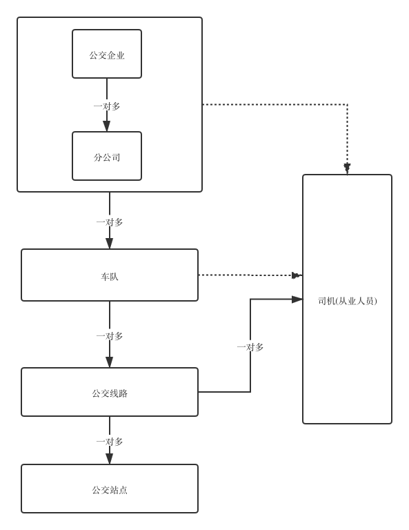

# 行业管理系统后端代码(IndustryManagement-Backend)
<!-- TOC -->

- 1. 开发环境
  - 1.1. 代码注视
  - 1.2. 开发调试
- 2. 系统模块命名
- 3. 错误码规范
- 4. 权限编码规范
  - 4.1. 编码规范
  - 4.2. 代码规范
- 5. API接口
- 6. OSS文件管理
  - 6.1. OSS文件-上传
  - 6.2. OSS文件-文本内容
  - 6.3. OSS文件-下载
  - 6.4. OSS文件-删除
- 7. 用户管理
  - 7.1. 用户登录
  - 7.2. 用户注销
  - 7.3. 获取我的个人信息
  - 7.4. 用户管理-列表
  - 7.5. 用户管理-详情
  - 7.6. 用户管理-新增
  - 7.7. 用户管理-修改
  - 7.8. 用户管理-禁用/启用
  - 7.9. 用户管理-删除
  - 7.10. 用户管理-重置密码
- 8. 公交企业管理
  - 8.1. 公交企业管理-列表
  - 8.2. 公交企业管理-新增
  - 8.3. 公交企业管理-编辑
  - 8.4. 公交企业管理-审核
  - 8.5. 公交企业管理-详情
  - 8.6. 公交企业管理-删除
  - 8.7. 公交企业管理-导出
  - 8.8. 公交企业管理-导入
- 9. 菜单管理
  - 9.1. 菜单管理-我的菜单
  - 9.2. 菜单管理-全部菜单
- 10. 角色管理
  - 10.1. 角色管理-列表
  - 10.2. 角色-详情
  - 10.3. 角色管理-新增
  - 10.4. 角色管理-编辑
  - 10.5. 角色管理-删除
- 11. 日志管理
  - 11.1. 日志管理-列表
- 12. 从业人员管理
  - 12.1. 从业人员管理-列表
  - 12.2. 从业人员管理-详情
  - 12.3. 从业人员管理-新增
  - 12.4. 从业人员管理-修改
  - 12.5. 从业人员管理-删除
  - 12.6. 从业人员管理-导出
  - 12.7. 从业人员管理-导入
  - 12.8. 从业人员管理-审核
- 13. 场站管理
  - 13.1. 场站管理-列表
  - 13.2. 场站管理-详情
  - 13.3. 场站管理-新增
  - 13.4. 场站管理-修改
  - 13.5. 场站管理-删除
  - 13.6. 场站管理-导出
  - 13.7. 场站管理-导入
  - 13.8. 场站管理-审核
- 14. 公交车辆管理
  - 14.1. 公交车辆管理-列表
  - 14.2. 公交车辆管理-新增
  - 14.3. 公交车辆管理-编辑
  - 14.4. 公交车辆管理-审核
  - 14.5. 公交车辆管理-详情
  - 14.6. 公交车辆管理-删除
  - 14.7. 公交车辆管理-导出
  - 14.8. 公交车辆管理-导入
- 15. 公交路线管理
  - 15.1. 公交路线管理-列表
  - 15.2. 公交路线管理-新增
  - 15.3. 公交路线管理-编辑
  - 15.4. 公交路线管理-审核
  - 15.5. 公交路线管理-详情
  - 15.6. 公交路线管理-删除
  - 15.7. 公交路线管理-导出
  - 15.8. 公交路线管理-导入
- 16. 公交车队管理
  - 16.1. 公交车队管理-列表
- 17. 字典管理
  - 17.1. 字典管理-根据编码获取字典值集合
  - 17.2. 字典管理-获取所有字典类型
- 18. 字典表类型说明
- 19. 公交站点管理
  - 19.1. 公交站点管理-列表
  - 19.2. 公交站点管理-详情
  - 19.3. 公交站点管理-新增
  - 19.4. 公交站点管理-修改
  - 19.5. 公交站点管理-删除
  - 19.6. 公交站点管理-导出
  - 19.7. 公交站点管理-导入
  - 19.8. 公交站点管理-审核
- 20. 行政管理
  - 20.1. 行政管理-列表
  - 20.2. 行政管理-详情
  - 20.3. 行政管理-新增
  - 20.4. 行政管理-修改
  - 20.5. 行政管理-删除
- 21. 投诉建议管理
  - 21.1. 投诉建议管理-列表
  - 21.2. 投诉建议管理-详情
  - 21.3. 投诉建议管理-新增
  - 21.4. 投诉建议管理-修改
  - 21.5. 投诉建议管理-删除
  - 21.6. 投诉建议管理-审核
- 22. 违规信息管理
  - 22.1. 违规信息管理-列表
  - 22.2. 违规信息管理-新增
  - 22.3. 违规信息管理-处理
  - 22.4. 违规信息管理-详情
  - 22.5. 违规信息管理-删除
  - 22.6. 违规信息管理-导出
  - 22.7. 违规信息管理-导入

<!-- /TOC -->




## 1. 开发环境

1. JDK 1.8+(包含1.8)

2. Maven 3.3+

3. 安装插件Lombok
- IDEA: https://projectlombok.org/setup/intellij
- Eclipse: https://projectlombok.org/setup/eclipse

### 1.1. 代码注视

File->Preferences->Editor->File and Code Templates->File Header

```java
/**
 * TODO(类的简要说明)
 * @author 这里填写开发者
 * @date ${DATE}
 */
```

### 1.2. 开发调试
访问swagger-ui管理界面 http://youhostname:8080/swagger-ui.html

对自己编写的接口进行开发调试测试

## 2. 系统模块命名

|模块名称|英文|Java包命名|
|---|---|---|
|公共模块|common|com.bms.common|
|系统管理模块|sys|com.bms.sys|
|公交行业管理系统|industry|com.bms.industry|
|公交综合运行监测与应急响应系统|monitor|com.bms.monitor|
|公交统计决策分析系统|statis|com.bms.statis|

## 3. 错误码规范

|模块|错误码范围|
|---|------|
|common|1000-9999|
|sys|10000-19999|
|industry|20000-29999|
|monitor|30000-39999|
|statis|40000-49999|

## 4. 权限编码规范

### 4.1. 编码规范
功能名称+下划线(_)+操作名称

|操作名称|命名|
|---|---|
|列表=查询|list|
|新增|create|
|编辑|edit|
|删除|delete|
|详情|details|
|禁用/启用|status|

例如：用户管理

|操作名称|命名|
|---|---|
|用户管理-列表=查询|user_list|
|用户管理-新增|user_create|
|用户管理-编辑|user_dit|
|用户管理-删除|user_delete|
|用户管理-详情|user_details|
|用户管理-禁用/启用|user_status|
|用户管理-重制密码|user_reset_passwd|

### 4.2. 代码规范
```java
    @RequiresPermissions("user_create")
    @PostMapping("")
    public Result<User> create(@RequestBody User user) {
        return ok(userService.insert(user));
    }

    @RequiresPermissions("user_list")
    @GetMapping("/list")
    public Result<PageList<User>> list(PageRequest pageRequest, String keyword) {
        return ok(userService.page(pageRequest, keyword));
    }

    @RequiresPermissions("user_details")
    @GetMapping("/{id}")
    public Result<User> details(@PathVariable Long id) {
        User user = userService.findById(id);
        return ok(user);
    }

    @RequiresPermissions("user_edit")
    @PutMapping("/{id}")
    public Result<User> edit(@PathVariable Long id, @RequestBody User updateBody) {
        User user = userService.updateById(id, updateBody);
        return ok(user);
    }

    @RequiresPermissions("user_delete")
    @DeleteMapping("/{id}")
    public Result<Long> delete(@PathVariable Long id) {
        User user = userService.deleteById(id);
        return ok(user.getId());
    }
```


## 5. API接口

## 6. OSS文件管理

### 6.1. OSS文件-上传

`header的Content-Type必须为multipart/form-data`

```
/images  图片
/docs    文档
/html    html内容
/videos  视频

```

```yaml
@post: /oss/:path

@header:
	Authorization:登录令牌(必须)	
	Content-Type:multipart/form-data

@params:
  path:string:上传文件时所使用的文件目录 参考[常用目录规则]

@payload:
  name:string:文件名
  file:file:上传的文件

@return:
  code:int:操作状态
    - 200:操作成功
    - 500:未知错误
    - 1003:文件内容无效
  data:object:返回存储文件的信息
    mimetype:string:文件类型
    filename:string:上传到OSS的文件路径
    originalname:string:原始文件名
    size:long:文件大小
    sha1:string:文件的SHA
    md5:string:文件的MD5
  success:bool:是否成功
  msg:string:操作提示

```


### 6.2. OSS文件-文本内容

`header的Content-Type必须为application/x-www-form-urlencoded`

```
@post: /oss/:path

@header:
	Authorization:登录令牌(必须)	
	Content-Type:application/x-www-form-urlencoded

@params:
    path:string:上传文件时所使用的文件目录 参考[常用目录规则]
    

@payload:
    suffix:string:文本内容的后缀名 .html .jpg .png
    text:string:文本内容

@return:
    code:int:操作状态
        - 200:操作成功
        - 500:未知错误
        - 31000:不支持的http消息头
    data:object:返回存储文件的信息
        mimetype:string:文件类型
            - text:文本
        filename:string:上传到OSS的文件路径
        size:long:文本长度
        sha1:string:文本的SHA
        md5:string:文本的MD5
    success:bool:是否成功
    msg:string:操作提示

```


### 6.3. OSS文件-下载

```yaml
@get: /oss/:path

@header:
	Authorization:登录令牌(必须)	

@params:
  path:string:post提交时的filename

@return:
    - 200:对应的文件流
    - 404:文件不存在壮体啊
```

### 6.4. OSS文件-删除

```yaml
@delete: /oss/:path

@header:
	Authorization:登录令牌(必须)	

@params:
  path:string:post提交时的filename

@return:
  code:int:操作状态
      - 200:操作成功
      - 500:未知错误
      - 404:文件不存在
  success:bool:是否成功
  msg:string:操作提示
```

## 7. 用户管理

### 7.1. 用户登录

```yaml
@post: /sys/login

@header:
  X-User-Agent:手机信息(必须)

@payload:
  account:string:账号
  passwd:string:密码

@return:
  code:int:操作码
    - 10000:密码错误
    - 10001:账号不存在
    - 1004:用户已禁用
  success:bool:是否成功
  msg:string:操作提示

```

### 7.2. 用户注销

```yaml
@post: /sys/logout

@header:
  X-User-Agent:手机信息(必须)
  Authorization:token令牌

@return:
  code:int:操作码
    - 1002:Session会话无效或过期，请重新登录
    - 10000:密码错误
    - 10001:账号不存在
    - 1004:用户已禁用
  success:bool:是否成功
  msg:string:操作提示

```

### 7.3. 获取我的个人信息

```yaml
@get: /sys/my/profiles


@header:
  X-User-Agent:手机信息(必须)
  Authorization:token令牌
@return:
  code:int:操作码
    - 1002:Session会话无效或过期，请重新登录
    - 10000:密码错误
    - 10001:账号不存在
    - 1004:用户已禁用
  data:object:我的个人信息
    id:long:用户ID
    account:string:账户
    organization:object:机构信息
      id:long:机构ID
      name:string:名称
      level:string:级别
      province:string:省
      city:string:市
      county:string:区/县
      address:string:详细地址
      business_license:string:营业执照(url)
      business_scope:string:经营范围
      operate_route:string:运营路线
      principal:string:负责人
      contact:string:联系方式
      remark:string:备注
    real_name:string:用户名
    remark:string:备注
    role:object:角色信息
      id:long:角色ID
      name:string:角色名称
      remark:string:描述
    status:int:用户状态
      - 0:禁用
      - 1:启用
  success:bool:是否成功
  msg:string:操作提示
```


### 7.4. 用户管理-列表

```yaml
@get: /sys/users/list

@header:
  X-User-Agent:手机信息(必须)
  Authorization:token令牌

@params:
  page:int:页码
  size:int:页码大小
  account:string:用户名
  real_name:string:真实姓名
  organization:string:企业名称
  status:int:状态
    - 0:禁用
    - 1:启用
@return:
  code:int:操作码
  data:object:返回信息
    count:int:分页总大小
    list:array<object>:用户列表信息
      id:long:用户ID
      account:string:账户
      organization:object:机构信息
        id:long:机构ID
        name:string:名称
        level:string:级别
        province:string:省
        city:string:市
        county:string:区/县
        address:string:详细地址
        business_license:string:营业执照(url)
        business_scope:string:经营范围
        operate_route:string:运营路线
        principal:string:负责人
        contact:string:联系方式
        remark:string:备注
      real_name:string:用户名
      remark:string:备注
      role:object:角色信息
        id:long:角色ID
        name:string:角色名称
        remark:string:描述
      status:int:用户状态
        - 0:禁用
        - 1:启用
  success:bool:是否成功
  msg:string:操作提示
```

### 7.5. 用户管理-详情

```yaml
@get: /sys/users/:id

@header:
  X-User-Agent:手机信息(必须)
  Authorization:token令牌

@params:
  id:long:用户id

@return:
  code:int:操作码
  data:object:返回信息
    id:long:用户ID
    account:string:账户
    organization:object:机构信息
      id:long:机构ID
      name:string:名称
      level:string:级别
      province:string:省
      city:string:市
      county:string:区/县
      address:string:详细地址
      business_license:string:营业执照(url)
      business_scope:string:经营范围
      operate_route:string:运营路线
      principal:string:负责人
      contact:string:联系方式
      remark:string:备注
    real_name:string:用户名
    remark:string:备注
    role:object:角色信息
      id:long:角色ID
      name:string:角色名称
      remark:string:描述
    status:int:用户状态
      - 0:禁用
      - 1:启用
  success:bool:是否成功
  msg:string:操作提示
```

### 7.6. 用户管理-新增

```yaml
@post: /sys/users

@header:
  X-User-Agent:手机信息(必须)
  Authorization:token令牌

@payload:
  account:string:账户
  passwd:string:密码
  organization:object:机构信息
    id:long:机构id
  real_name:string:用户名
  remark:string:备注
  role:object:角色信息
    id:long:角色id
  status:int:用户状态
    - 0:禁用
    - 1:启用
  
@return:
  code:int:操作码
  data:object:返回信息
    id:long:用户ID
  success:bool:是否成功
  msg:string:操作提示
```

### 7.7. 用户管理-修改

```yaml
@put: /sys/users/:id

@header:
  X-User-Agent:手机信息(必须)
  Authorization:token令牌

@params:
  id:long:用户id

@payload:
  organization:object:机构信息
    id:long:机构id
  real_name:string:用户名
  remark:string:备注
  role:object:角色信息
    id:long:角色id
  
@return:
  code:int:操作码
  data:object:返回信息
    id:long:用户ID
    account:string:账户
    organization:object:机构信息
    real_name:string:用户名
    remark:string:备注
    role:object:角色信息
    status:int:用户状态
      - 0:禁用
      - 1:启用
  success:bool:是否成功
  msg:string:操作提示
```

### 7.8. 用户管理-禁用/启用

```yaml
@put: /sys/users/:id/status/:status

@header:
  X-User-Agent:手机信息(必须)
  Authorization:token令牌

@params:
  id:long:用户id
  status:int:用户状态
    - 0:禁用
    - 1:启用
  
@return:
  code:int:操作码
  data:object:返回信息
    id:long:用户ID
    account:string:账户
    organization:object:机构信息
    real_name:string:用户名
    remark:string:备注
    role:object:角色信息
    status:int:用户状态
      - 0:禁用
      - 1:启用
  success:bool:是否成功
  msg:string:操作提示
```
### 7.9. 用户管理-删除

```yaml
@delete: /sys/users/:id

@header:
  X-User-Agent:手机信息(必须)
  Authorization:token令牌

@params:
  id:long:用户ID

@return:
  code:int:操作码
  data:object:返回信息
    id:long:用户ID
  success:bool:是否成功
  msg:string:操作提示
```

### 7.10. 用户管理-重置密码

```yaml
@post: /sys/users/:id/resetpasswd

@header:
  X-User-Agent:手机信息(必须)
  Authorization:token令牌

@params:
  id:long:用户ID

@return:
  code:int:操作码
  data:object:用户信息
    id:long:用户ID
  success:bool:是否成功
  msg:string:操作提示
```

## 8. 公交企业管理

### 8.1. 公交企业管理-列表

```yaml
@get: /sys/organizations/list?page=:page&size=:size&name=:name&status=:status

@header:
  X-User-Agent:手机信息(必须)
  Authorization:token令牌

@params:
  page:int:页码
  size:int:页码大小
  name:string:机构名称
  level:int:机构级别
  status:int:状态
    - 1:待审核 
    - 2:通过审核 
    - 3:未通过审核

@return:
  code:int:操作码
  data:object:分页信息
    count:int:分页总大小
    list:array<object>:机构列表信息
      id:long:机构ID
      name:string:名称
      level:string:级别
      province:string:省
      city:string:市
      county:string:区/县
      address:string:详细地址
      business_license:string:营业执照(url)
      business_scope:string:经营范围
      company_no:string:公司编号
      scale:string:企业规模
      sales_volume:int:销售额
      staff_number:int:员工人数
      vehicle_number:int:车辆数
      station_number:int:车站数
      operate_route:string:运营路线
      principal:string:负责人
      contact:string:联系方式
      remark:string:备注
      status:int:状态(1:待审核 2:通过审核 3:未通过审核)
      parent:object:上级公司信息
        id:long:ID
        name:string:名称
      car_team_list:arry<object>:车队信息
        id:long:ID
        oid:string:旧系统ID
        name:string:车队名称
        address:string:地址
        telephone:string:电话
        principal:string:负责人
        num:string:车队编号
        create_date:date:创建时间
        status:int:状态
      reason:string:理由
      audit_list:array<object>:审核记录
        id:long:审核ID
        reason:string:原因
        create_date:date:创建时间
        create_user:long:创建用户
        last_upd_date:date:最后修改时间
        last_upd_user:long:最后修改人

  success:bool:是否成功
  msg:string:操作提示
```

### 8.2. 公交企业管理-新增

```yaml
@post: /sys/organizations

@header:
  X-User-Agent:手机信息(必须)
  Authorization:token令牌

@payload:
  name:string:名称
  level:string:级别
  province:string:省
  city:string:市
  county:string:区/县
  address:string:详细地址
  business_license:string:营业执照(url)
  business_scope:string:经营范围
  operate_route:string:运营路线
  principal:string:负责人
  contact:string:联系方式
  remark:string:备注

@return:
  code:int:操作码
  data:object:返回机构信息
    id:long:机构ID
  success:bool:是否成功
  msg:string:操作提示
```

### 8.3. 公交企业管理-编辑

```yaml
@put: /sys/organizations/:id

@header:
  X-User-Agent:手机信息(必须)
  Authorization:token令牌

@params:
  id:long:机构ID

@payload:
  name:string:名称
  level:string:级别
  province:string:省
  city:string:市
  county:string:区/县
  address:string:详细地址
  business_license:string:营业执照(url)
  business_scope:string:经营范围
  operate_route:string:运营路线
  principal:string:负责人
  contact:string:联系方式
  remark:string:备注

@return:
  code:int:操作码
  data:object:返回机构信息
    id:long:机构ID
  success:bool:是否成功
  msg:string:操作提示
```

### 8.4. 公交企业管理-审核

```yaml
@post: /sys/organizations/:id/status/:status

@header:
  X-User-Agent:手机信息(必须)
  Authorization:token令牌

@params:
  id:long:机构ID
  status:int:状态(1:待审核 2:通过审核 3:未通过审核)

@payload:
  reason:string:理由

@return:
  code:int:操作码
  success:bool:是否成功
  msg:string:操作提示
```

### 8.5. 公交企业管理-详情

```yaml
@get: /sys/organizations/:id

@header:
  X-User-Agent:手机信息(必须)
  Authorization:token令牌

@params:
  id:long:机构ID

@return:
  code:int:操作码
  data:object:返回机构信息
    id:long:机构ID
    name:string:名称
    level:string:级别
    province:string:省
    city:string:市
    county:string:区/县
    address:string:详细地址
    business_license:string:营业执照(url)
    business_scope:string:经营范围
    operate_route:string:运营路线
    principal:string:负责人
    contact:string:联系方式
    remark:string:备注
    status:int:状态(1:待审核 2:通过审核 3:未通过审核)
    reason:string:理由
  success:bool:是否成功
  msg:string:操作提示
```

### 8.6. 公交企业管理-删除

```yaml
@delete: /sys/organizations/:id

@header:
  X-User-Agent:手机信息(必须)
  Authorization:token令牌

@params:
  id:long:机构ID

@return:
  code:int:操作码
  data:object:返回机构信息
    id:long:机构ID
  success:bool:是否成功
  msg:string:操作提示
```

### 8.7. 公交企业管理-导出

```yaml
@get: /sys/organizations/export?name=:name&status=:status

@header:
  X-User-Agent:手机信息(必须)
  Authorization:token令牌

@params:
  name:string:机构名称
  status:int:状态
    - 1:待审核
    - 2:通过审核
    - 3:未通过审核

@return:
  code:int:操作码
    - 10002:导出数据出错
  success:bool:是否成功
  msg:string:操作提示
```

### 8.8. 公交企业管理-导入

```yaml
@post: /sys/organizations/import

@header:
  X-User-Agent:手机信息(必须)
  Authorization:token令牌

@payload:
  name:string:文件名
  file:file:导入的文件

@return:
  code:int:操作码
    - 10003:导入数据出错
  success:bool:是否成功
  msg:string:操作提示
```

## 9. 菜单管理

### 9.1. 菜单管理-我的菜单

```yaml
@get: /sys/menus/my

@header:
  X-User-Agent:手机信息(必须)
  Authorization:token令牌


@return:
  code:int:操作码
  data:array<object>:菜单信息
    name:string:名称
    path:string:路径
    icon:string:图标
    index:int:顺序
    children:array<object>:子菜单
        name:string:名称
        path:string:路径
        parent:string:父菜单的path
        index:int:顺序
  success:bool:是否成功
  msg:string:操作提示
```

### 9.2. 菜单管理-全部菜单

```yaml
@get: /sys/menus/all

@header:
  X-User-Agent:手机信息(必须)
  Authorization:token令牌

@return:
  code:int:操作码
  data:array<object>:菜单信息
    name:string:名称
    path:string:路径
    icon:string:图标
    index:int:顺序
    type:int:类型(1=菜单 2=按钮)
    children:array<object>:子菜单
        name:string:名称
        path:string:路径
        parent:string:父菜单的path
        index:int:顺序
        type:int:类型(1=菜单 2=按钮)
  success:bool:是否成功
  msg:string:操作提示
```

## 10. 角色管理

### 10.1. 角色管理-列表

```yaml
@get: /sys/roles/list

@header:
  X-User-Agent:手机信息(必须)
  Authorization:token令牌

@params:
  page:int:页码
  size:int:页码大小
  name:string:角色名
  remark:string:角色描述

@return:
  code:int:操作码
  data:object:返回信息
    count:int:分页总大小
    list:array<object>:机构列表信息
      id:long:角色ID
      name:string:角色名称
      remark:string:描述
      user_list:array<object>:用户信息
        id:long:用户ID
  success:bool:是否成功
  msg:string:操作提示
```
### 10.2. 角色-详情

```yaml
@get: /sys/roles/:id

@header:
  X-User-Agent:手机信息(必须)
  Authorization:token令牌

@params:
  id:long:角色ID

@return:
  code:int:操作码
  data:object:返回信息
    id:long:角色ID
    name:string:角色名称
    remark:string:描述
  success:bool:是否成功
  msg:string:操作提示
```

### 10.3. 角色管理-新增

```yaml
@post: /sys/roles

@header:
  X-User-Agent:手机信息(必须)
  Authorization:token令牌

@payload:
  name:string:角色名称
  remark:string:描述
  menu_list:array<object>:菜单信息
    id:long:选择的菜单ID
  
@return:
  code:int:操作码
  data:object:返回信息
    id:long:角色ID
  success:bool:是否成功
  msg:string:操作提示
```

### 10.4. 角色管理-编辑

```yaml
@put: /sys/roles/:id

@header:
  X-User-Agent:手机信息(必须)
  Authorization:token令牌

@params:
  id:long:菜单ID

@payload:
  name:string:角色名称
  remark:string:描述
  menu_list:array<object>:菜单信息
    id:long:选择的菜单ID
  
@return:
  code:int:操作码
  data:object:返回信息
    id:long:角色ID
    name:string:角色名称
    remark:string:描述
  success:bool:是否成功
  msg:string:操作提示
```


### 10.5. 角色管理-删除

```yaml
@delete: /sys/roles/:id

@header:
  X-User-Agent:手机信息(必须)
  Authorization:token令牌

@params:
  id:long:角色ID

@return:
  code:int:操作码
  data:object:返回信息
    id:long:角色ID
  success:bool:是否成功
  msg:string:操作提示
```

## 11. 日志管理

### 11.1. 日志管理-列表

```yaml
@get: /sys/oplogs/list?page=:page&size=:size

@header:
  X-User-Agent:手机信息(必须)
  Authorization:token令牌

@params:
  page:int:页码
  size:int:页码大小
  account:string:用户名
  real_name:string:真实姓名
  org_name:string:机构名称
  module:string:模块
  func_name:string:操作名称
  params:string:参数
  ip:string:IP
  begin:date:开始时间
  end:date:结束时间

@return:
  code:int:操作码
  data:object:分页信息
    count:int:分页总大小
    list:array<object>:日志列表信息
      id:long:机构ID
      account:string:用户名
      real_name:string:真实姓名
      org_name:string:机构名称
      module:string:模块
      func_name:string:操作名称
      params:string:参数
      ip:string:IP
      create_date:date:操作时间

  success:bool:是否成功
  msg:string:操作提示
```

## 12. 从业人员管理

### 12.1. 从业人员管理-列表

```yaml
@get: /industry/practitioners/list

@header:
  X-User-Agent:手机信息(必须)
  Authorization:token令牌

@params:
  page:int:页码
  size:int:页码大小
  name:string:姓名
  gender:string:性别
    - M:男
    - F:女
    - N:未知
  cert_no:string:资格证号
  id_number:string:高价证号
  organization:string:企业名称
@return:
  code:int:操作码
  data:object:返回信息
    count:int:分页总大小
    list:array<object>:人员列表信息
      id:long:人员ID
      name:string:人员姓名
      gender:string:性别
        - M:男
        - F:女
        - N:未知
      age:int:年龄
      driving_age:int:架龄
      cert_no:string:资格证号
      id_number:string:身份证号
      phone:string:联系号码
      email:string:电子邮箱
      address:string:通讯地址
      organization:object:机构信息
        id:long:机构ID
        name:string:名称
        level:string:级别
        province:string:省
        city:string:市
        county:string:区/县
        address:string:详细地址
        business_license:string:营业执照(url)
        business_scope:string:经营范围
        operate_route:string:运营路线
        principal:string:负责人
        contact:string:联系方式
        remark:string:备注
      car_team:object:车队
        id:long:ID
        name:string:名称
      staff_number:string:员工工号
      card_number:string:卡号
      type:string:从业类型
      bus_route:object:线路
        id:long:线路id
        name:string:线路名
      remark:string:备注
      status:int:状态(1:待审核 2:通过审核 3:未通过审核)
  success:bool:是否成功
  msg:string:操作提示
```

### 12.2. 从业人员管理-详情

```yaml
@get: /industry/practitioners/:id

@header:
  X-User-Agent:手机信息(必须)
  Authorization:token令牌

@params:
  id:long:用户id

@return:
  code:int:操作码
  data:object:返回信息
    id:long:人员ID
    name:string:人员姓名
    gender:string:性别
      - M:男
      - F:女
      - N:未知
    age:int:年龄
    driving_age:int:架龄
    cert_no:string:资格证号
    id_number:string:身份证号
    phone:string:联系号码
    email:string:电子邮箱
    address:string:通讯地址
    organization:object:机构信息
      id:long:机构ID
      name:string:名称
      level:string:级别
      province:string:省
      city:string:市
      county:string:区/县
      address:string:详细地址
      business_license:string:营业执照(url)
      business_scope:string:经营范围
      operate_route:string:运营路线
      principal:string:负责人
      contact:string:联系方式
      remark:string:备注
    car_team:object:车队
        id:long:ID
        name:string:名称
    staff_number:string:员工工号
    card_number:string:卡号
    type:string:从业类型
    bus_route:object:线路
      id:long:线路id
      name:string:线路名
    remark:string:备注
    status:int:状态(1:待审核 2:通过审核 3:未通过审核)
  success:bool:是否成功
  msg:string:操作提示
```

### 12.3. 从业人员管理-新增

```yaml
@post: /industry/practitioners

@header:
  X-User-Agent:手机信息(必须)
  Authorization:token令牌

@payload:
  name:string:人员姓名
  gender:string:性别
    - M:男
    - F:女
    - N:未知
  age:int:年龄
  driving_age:int:架龄
  cert_no:string:资格证号
  id_number:string:身份证号
  phone:string:联系号码
  email:string:电子邮箱
  address:string:通讯地址
  organization:object:机构信息
    id:long:机构ID
  car_team:object:车队
    id:long:ID
  staff_number:string:员工工号
  card_number:string:卡号
  type:string:从业类型
  bus_route:object:线路
    id:long:线路id
  remark:string:备注
  
@return:
  code:int:操作码
  data:object:返回信息
    id:long:人员ID
  success:bool:是否成功
  msg:string:操作提示
```

### 12.4. 从业人员管理-修改

```yaml
@put: /industry/practitioners/:id

@header:
  X-User-Agent:手机信息(必须)
  Authorization:token令牌

@params:
  id:long:用户id

@payload:
  name:string:人员姓名
  gender:string:性别
    - M:男
    - F:女
    - N:未知
  age:int:年龄
  driving_age:int:架龄
  cert_no:string:资格证号
  id_number:string:身份证号
  phone:string:联系号码
  address:string:通讯地址
  organization:object:机构信息
    id:long:机构id
  car_team:object:车队
    id:long:ID
  staff_number:string:员工工号
  card_number:string:卡号
  type:string:从业类型
  car_team:object:车队
    id:long:ID
  remark:string:备注

@return:
  code:int:操作码
  data:object:返回信息
    id:long:人员ID
    name:string:人员姓名
    gender:string:性别
      - M:男
      - F:女
      - N:未知
    age:int:年龄
    driving_age:int:架龄
    cert_no:string:资格证号
    id_number:string:身份证号
    phone:string:联系号码
    email:string:电子邮箱
    address:string:通讯地址
    organization:object:机构信息
      id:long:机构ID
      name:string:名称
      level:string:级别
      province:string:省
      city:string:市
      county:string:区/县
      address:string:详细地址
      business_license:string:营业执照(url)
      business_scope:string:经营范围
      operate_route:string:运营路线
      principal:string:负责人
      contact:string:联系方式
      remark:string:备注
    car_team:object:车队
      id:long:ID
      name:string:名称
    staff_number:string:员工工号
    card_number:string:卡号
    type:string:从业类型
    bus_route:object:线路
      id:long:线路id
      name:string:线路名
    remark:string:备注
    status:int:状态(1:待审核 2:通过审核 3:未通过审核)
  success:bool:是否成功
  msg:string:操作提示
```

### 12.5. 从业人员管理-删除

```yaml
@delete: /industry/practitioners/:id

@header:
  X-User-Agent:手机信息(必须)
  Authorization:token令牌

@params:
  id:long:人员ID

@return:
  code:int:操作码
  data:object:返回信息
    id:long:人员ID
  success:bool:是否成功
  msg:string:操作提示
```

### 12.6. 从业人员管理-导出

```yaml
@get: /industry/practitioners/export?name=:name&status=:status

@header:
  X-User-Agent:手机信息(必须)
  Authorization:token令牌

@params:
  name:string:姓名
  gender:string:性别
    - M:男
    - F:女
    - N:未知
  cert_no:string:资格证号
  id_number:string:高价证号
  organization:string:企业名称

@return:
  code:int:操作码
    - 10002:导出数据出错
  success:bool:是否成功
  msg:string:操作提示
```

### 12.7. 从业人员管理-导入

```yaml
@post: /industry/practitioners/import

@header:
  X-User-Agent:手机信息(必须)
  Authorization:token令牌

@payload:
  name:string:文件名
  file:file:导入的文件

@return:
  code:int:操作码
    - 10003:导入数据出错
  success:bool:是否成功
  msg:string:操作提示
```

### 12.8. 从业人员管理-审核

```yaml
@post: /industry/practitioners/:id/status/:status

@header:
  X-User-Agent:手机信息(必须)
  Authorization:token令牌

@params:
  id:long:ID
  status:int:状态(1:待审核 2:通过审核 3:未通过审核)

@payload:
  reason:string:理由

@return:
  code:int:操作码
  success:bool:是否成功
  msg:string:操作提示
```


## 13. 场站管理

### 13.1. 场站管理-列表

```yaml
@get: /industry/busterminals/list

@header:
  X-User-Agent:手机信息(必须)
  Authorization:token令牌

@params:
  page:int:页码
  size:int:页码大小
  name:string:名称
  code:string:编号
  type:string:类型
  status:int:状态(1:待审核 2:通过审核 3:未通过审核)

@return:
  code:int:操作码
  data:object:返回信息
    count:int:分页总大小
    list:array<object>:场站列表信息
      id:long:人员ID
      name:string:名称
      code:string:编码
      type:string:类型
      area:float:面积
      address:string:地址
      longitude:float:经度
      latitude:float:纬度
      parking_number:int:停车数
      photos:string:现场照片
      organization:object:机构信息
        id:long:机构ID
        name:string:名称
        level:string:级别
        province:string:省
        city:string:市
        county:string:区/县
        address:string:详细地址
        business_license:string:营业执照(url)
        business_scope:string:经营范围
        operate_route:string:运营路线
        principal:string:负责人
        contact:string:联系方式
        remark:string:备注
      remark:string:备注
      status:int:状态(1:待审核 2:通过审核 3:未通过审核)
  success:bool:是否成功
  msg:string:操作提示
```

### 13.2. 场站管理-详情

```yaml
@get: /industry/busterminals/:id

@header:
  X-User-Agent:手机信息(必须)
  Authorization:token令牌

@params:
  id:long:用户id

@return:
  code:int:操作码
  data:object:返回信息
    id:long:人员ID
    name:string:名称
    code:string:编码
    type:string:类型
    area:float:面积
    address:string:地址
    longitude:float:经度
    latitude:float:纬度
    parking_number:int:停车数
    photos:string:现场照片
    organization:object:机构信息
      id:long:机构ID
      name:string:名称
      level:string:级别
      province:string:省
      city:string:市
      county:string:区/县
      address:string:详细地址
      business_license:string:营业执照(url)
      business_scope:string:经营范围
      operate_route:string:运营路线
      principal:string:负责人
      contact:string:联系方式
      remark:string:备注
    remark:string:备注
    status:int:状态(1:待审核 2:通过审核 3:未通过审核)
  success:bool:是否成功
  msg:string:操作提示
```

### 13.3. 场站管理-新增

```yaml
@post: /industry/busterminals

@header:
  X-User-Agent:手机信息(必须)
  Authorization:token令牌

@payload:
  name:string:名称
  code:string:编码
  type:string:类型
  area:float:面积
  address:string:地址
  longitude:float:经度
  latitude:float:纬度
  parking_number:int:停车数
  photos:string:现场照片（逗号分隔）
  organization:object:机构信息
    id:long:机构ID
  remark:string:备注
  
@return:
  code:int:操作码
  data:object:返回信息
    id:long:场站ID
  success:bool:是否成功
  msg:string:操作提示
```

### 13.4. 场站管理-修改

```yaml
@put: /industry/busterminals/:id

@header:
  X-User-Agent:手机信息(必须)
  Authorization:token令牌

@params:
  id:long:场站id

@payload:
  name:string:名称
  code:string:编码
  type:string:类型
  area:float:面积
  address:string:地址
  longitude:float:经度
  latitude:float:纬度
  parking_number:int:停车数
  photos:string:现场照片（逗号分隔）
  organization:object:机构信息
    id:long:机构ID
  remark:string:备注
  
@return:
  code:int:操作码
  data:object:返回信息
    id:long:人员ID
    name:string:名称
    code:string:编码
    type:string:类型
    area:float:面积
    address:string:地址
    longitude:float:经度
    latitude:float:纬度
    parking_number:int:停车数
    photos:string:现场照片
    organization:object:机构信息
      id:long:机构ID
      name:string:名称
      level:string:级别
      province:string:省
      city:string:市
      county:string:区/县
      address:string:详细地址
      business_license:string:营业执照(url)
      business_scope:string:经营范围
      operate_route:string:运营路线
      principal:string:负责人
      contact:string:联系方式
      remark:string:备注
    remark:string:备注
    status:int:状态(1:待审核 2:通过审核 3:未通过审核)
  success:bool:是否成功
  msg:string:操作提示
```

### 13.5. 场站管理-删除

```yaml
@delete: /industry/busterminals/:id

@header:
  X-User-Agent:手机信息(必须)
  Authorization:token令牌

@params:
  id:long:场站ID

@return:
  code:int:操作码
  data:object:返回信息
    id:long:场站ID
  success:bool:是否成功
  msg:string:操作提示
```
### 13.6. 场站管理-导出

```yaml
@get: /industry/busterminals/export?name=:name&status=:status

@header:
  X-User-Agent:手机信息(必须)
  Authorization:token令牌

@params:
  name:string:名称
  code:string:编号
  type:string:类型

@return:
  code:int:操作码
    - 10002:导出数据出错
  success:bool:是否成功
  msg:string:操作提示
```

### 13.7. 场站管理-导入

```yaml
@post: /industry/busterminals/import

@header:
  X-User-Agent:手机信息(必须)
  Authorization:token令牌

@payload:
  name:string:文件名
  file:file:导入的文件

@return:
  code:int:操作码
    - 10003:导入数据出错
  success:bool:是否成功
  msg:string:操作提示
```


### 13.8. 场站管理-审核

```yaml
@post: /industry/busterminals/:id/status/:status

@header:
  X-User-Agent:手机信息(必须)
  Authorization:token令牌

@params:
  id:long:ID
  status:int:状态(1:待审核 2:通过审核 3:未通过审核)

@payload:
  reason:string:理由

@return:
  code:int:操作码
  success:bool:是否成功
  msg:string:操作提示
```

## 14. 公交车辆管理

### 14.1. 公交车辆管理-列表

```yaml
@get: /industry/vehicles/list?page=:page&size=:size

@header:
  X-User-Agent:手机信息(必须)
  Authorization:token令牌

@params:
  page:int:页码
  size:int:页码大小
  lic_no:string:车牌号
  vin:string:VIN码
  fuel_type:int:燃料类型
  card_time:date:上牌时间
  status:int:状态
    - 1:待审核 
    - 2:通过审核 
    - 3:未通过审核

@return:
  code:int:操作码
  data:object:分页信息
    count:int:分页总大小
    list:array<object>:公交车辆列表信息
      id:long:ID
      lic_no:string:车牌号
      vin:string:VIN码
      length:float:车长
      width:float:车宽
      height:float:车高
      fuel_type:int:燃料类型
      -- veh_type:int:车辆型号 改为string
      <font color=red>添加字段-开始</font>
      veh_type:string:车辆型号 改为String 必填
      load_num:int:载客数量
      factory_name:string:制造商
      product_date:date:生产日期
      register_date:date:投产日期
      purpose:string:用途
      car_help:int:是否助力(1=是  0=否)
      engine:int:前后置发动机(1=前  2=后)
      air_condition:int:是否空调(1=是  0=否)
      <font color=red>添加字段-结束</font>
      card_time:date:上牌时间
      sim:string:SIM卡号
      terminal_no:string:车载终端编号
      organization:object:所属企业
        id:long:ID
        name:string:名称
      car_team:object:车队
        id:long:ID
        name:string:名称
      -- route:string:路线 删掉此字段
      bus_route:object:公交路线信息
        id:long:ID
        name:string:名称
      seat_num:int:座位数
      remark:string:备注
      status:int:状态(1:待审核 2:通过审核 3:未通过审核)
      reason:string:理由
      audit_list:array<object>:审核记录
        id:long:审核ID
        reason:string:原因
        create_date:date:创建时间
        create_user:long:创建用户
        last_upd_date:date:最后修改时间
        last_upd_user:long:最后修改人

  success:bool:是否成功
  msg:string:操作提示
```

### 14.2. 公交车辆管理-新增

```yaml
@post: /industry/vehicles

@header:
  X-User-Agent:手机信息(必须)
  Authorization:token令牌

@payload:
  lic_no:string:车牌号
  vin:string:VIN码
  length:float:车长
  width:float:车宽
  height:float:车高
  fuel_type:int:燃料类型
  -- veh_type:int:车辆型号 改为string
  <font color=red>添加字段-开始</font>
  veh_type:string:车辆型号 改为String 必填
  load_num:int:载客数量
  factory_name:string:制造商
  product_date:date:生产日期
  register_date:date:投产日期
  purpose:string:用途
  car_help:int:是否助力(1=是  0=否)
  engine:int:前后置发动机(1=前  2=后)
  air_condition:int:是否空调(1=是  0=否)
  <font color=red>添加字段-结束</font>
  card_time:date:上牌时间
  sim:string:SIM卡号
  terminal_no:string:车载终端编号
  organization:object:所属企业
    id:long:ID
    name:string:名称
  car_team:object:车队
    id:long:ID
    name:string:名称
  -- route:string:路线 删掉此字段
  bus_route:object:公交路线信息
    id:long:ID
    name:string:名称
  seat_num:int:座位数
  remark:string:备注
  status:int:状态(1:待审核 2:通过审核 3:未通过审核)

@return:
  code:int:操作码
  data:object:返回机构信息
    id:long:ID
  success:bool:是否成功
  msg:string:操作提示
```

### 14.3. 公交车辆管理-编辑

```yaml
@put: /industry/vehicles/:id

@header:
  X-User-Agent:手机信息(必须)
  Authorization:token令牌

@params:
  id:long:ID

@payload:
  lic_no:string:车牌号
  vin:string:VIN码
  length:float:车长
  width:float:车宽
  height:float:车高
  fuel_type:int:燃料类型
  -- veh_type:int:车辆型号 改为string
  <font color=red>添加字段-开始</font>
  veh_type:string:车辆型号 改为String 必填
  load_num:int:载客数量
  factory_name:string:制造商
  product_date:date:生产日期
  register_date:date:投产日期
  purpose:string:用途
  car_help:int:是否助力(1=是  0=否)
  engine:int:前后置发动机(1=前  2=后)
  air_condition:int:是否空调(1=是  0=否)
  <font color=red>添加字段-结束</font>
  card_time:date:上牌时间
  sim:string:SIM卡号
  terminal_no:string:车载终端编号
  organization:object:所属企业
    id:long:ID
    name:string:名称
  car_team:object:车队
    id:long:ID
    name:string:名称
  -- route:string:路线 删掉此字段
  bus_route:object:公交路线信息
    id:long:ID
    name:string:名称
  seat_num:int:座位数
  remark:string:备注
  status:int:状态(1:待审核 2:通过审核 3:未通过审核)

@return:
  code:int:操作码
  data:object:返回机构信息
    id:long:ID
  success:bool:是否成功
  msg:string:操作提示
```

### 14.4. 公交车辆管理-审核

```yaml
@post: /industry/vehicles/:id/status/:status

@header:
  X-User-Agent:手机信息(必须)
  Authorization:token令牌

@params:
  id:long:ID
  status:int:状态(1:待审核 2:通过审核 3:未通过审核)

@payload:
  reason:string:理由

@return:
  code:int:操作码
  success:bool:是否成功
  msg:string:操作提示
```

### 14.5. 公交车辆管理-详情

```yaml
@get: /industry/vehicles/:id

@header:
  X-User-Agent:手机信息(必须)
  Authorization:token令牌

@params:
  id:long:ID

@return:
  code:int:操作码
  data:object:返回机构信息
    id:long:ID
    lic_no:string:车牌号
    vin:string:VIN码
    length:float:车长
    width:float:车宽
    height:float:车高
    fuel_type:int:燃料类型
    -- veh_type:int:车辆型号 改为string
    <font color=red>添加字段-开始</font>
    veh_type:string:车辆型号 改为String 必填
    load_num:int:载客数量
    factory_name:string:制造商
    product_date:date:生产日期
    register_date:date:投产日期
    purpose:string:用途
    car_help:int:是否助力(1=是  0=否)
    engine:int:前后置发动机(1=前  2=后)
    air_condition:int:是否空调(1=是  0=否)
    <font color=red>添加字段-结束</font>
    card_time:date:上牌时间
    sim:string:SIM卡号
    terminal_no:string:车载终端编号
    organization:object:所属企业
      id:long:ID
      name:string:名称
    car_team:object:车队
      id:long:ID
      name:string:名称
    -- route:string:路线 删掉此字段
    bus_route:object:公交路线信息
      id:long:ID
      name:string:名称
    seat_num:int:座位数
    remark:string:备注
    status:int:状态(1:待审核 2:通过审核 3:未通过审核)
    reason:string:理由
    audit_list:array<object>:审核记录
      id:long:审核ID
      reason:string:原因
      create_date:date:创建时间
      create_user:long:创建用户
      last_upd_date:date:最后修改时间
      last_upd_user:long:最后修改人
  success:bool:是否成功
  msg:string:操作提示
```

### 14.6. 公交车辆管理-删除

```yaml
@delete: /industry/vehicles/:id

@header:
  X-User-Agent:手机信息(必须)
  Authorization:token令牌

@params:
  id:long:ID

@return:
  code:int:操作码
  data:object:返回机构信息
    id:long:ID
  success:bool:是否成功
  msg:string:操作提示
```

### 14.7. 公交车辆管理-导出

```yaml
@get: /industry/vehicles/export?name=:name&status=:status

@header:
  X-User-Agent:手机信息(必须)
  Authorization:token令牌

@params:
  name:string:机构名称
  status:int:状态
    - 1:待审核
    - 2:通过审核
    - 3:未通过审核

@return:
  code:int:操作码
    - 10002:导出数据出错
  success:bool:是否成功
  msg:string:操作提示
```

### 14.8. 公交车辆管理-导入

```yaml
@post: /industry/vehicles/import

@header:
  X-User-Agent:手机信息(必须)
  Authorization:token令牌

@payload:
  name:string:文件名
  file:file:导入的文件

@return:
  code:int:操作码
    - 10003:导入数据出错
  success:bool:是否成功
  msg:string:操作提示
```

## 15. 公交路线管理


### 15.1. 公交路线管理-列表

```yaml
@get: /industry/busroutes/list?page=:page&size=:size

@header:
  X-User-Agent:手机信息(必须)
  Authorization:token令牌

@params:
  page:int:页码
  size:int:页码大小
  name:string:名称
  mileage:string:里程
  organization.name:string:所属企业
  price:float:票价
  way_sites:string:途经站点
  status:int:状态
    - 1:待审核 
    - 2:通过审核 
    - 3:未通过审核

@return:
  code:int:操作码
  data:object:分页信息
    count:int:分页总大小
    list:array<object>:公交车辆列表信息
      id:long:ID
      name:string:名称
      code:string:编号
      <font color=red>添加字段-开始</font>
      type:int:线路类型(字典表中获取)
      <font color=red>添加字段-结束</font>
      price:float:票价
      mileage:string:里程
      start_site:string:首发站
      end_site:string:终点站
      way_sites:string:途经站点
      startTime:date:首班时间
      lastTime:date:首班时间
      remark:string:备注
      status:int:状态(1:待审核 2:通过审核 3:未通过审核)
      organization:object:所属企业
        id:long:ID
        name:string:名称
      car_team:object:车队
        id:long:ID
        name:string:名称
      reason:string:理由
      audit_list:array<object>:审核记录
        id:long:审核ID
        reason:string:原因
        create_date:date:创建时间
        create_user:long:创建用户
        last_upd_date:date:最后修改时间
        last_upd_user:long:最后修改人

  success:bool:是否成功
  msg:string:操作提示
```

### 15.2. 公交路线管理-新增

```yaml
@post: /industry/busroutes

@header:
  X-User-Agent:手机信息(必须)
  Authorization:token令牌

@payload:
  name:string:名称
  code:string:编号
  price:float:票价
  mileage:string:里程
  start_site:string:首发站
  end_site:string:终点站
  way_sites:string:途经站点
  startTime:date:首班时间
  lastTime:date:首班时间
  remark:string:备注
  organization:object:所属企业
    id:long:ID
    name:string:名称
  car_team:object:车队
    id:long:ID
    name:string:名称

@return:
  code:int:操作码
  data:object:返回机构信息
    id:long:ID
  success:bool:是否成功
  msg:string:操作提示
```

### 15.3. 公交路线管理-编辑

```yaml
@put: /industry/busroutes/:id

@header:
  X-User-Agent:手机信息(必须)
  Authorization:token令牌

@params:
  id:long:ID

@payload:
  name:string:名称
  code:string:编号
  price:float:票价
  mileage:string:里程
  start_site:string:首发站
  end_site:string:终点站
  way_sites:string:途经站点
  startTime:date:首班时间
  lastTime:date:首班时间
  remark:string:备注
  organization:object:所属企业
    id:long:ID
    name:string:名称
  car_team:object:车队
    id:long:ID
    name:string:名称

@return:
  code:int:操作码
  data:object:返回机构信息
    id:long:ID
  success:bool:是否成功
  msg:string:操作提示
```

### 15.4. 公交路线管理-审核

```yaml
@post: /industry/busroutes/:id/status/:status

@header:
  X-User-Agent:手机信息(必须)
  Authorization:token令牌

@params:
  id:long:ID
  status:int:状态(1:待审核 2:通过审核 3:未通过审核)

@payload:
  reason:string:理由

@return:
  code:int:操作码
  success:bool:是否成功
  msg:string:操作提示
```

### 15.5. 公交路线管理-详情

```yaml
@get: /industry/busroutes/:id

@header:
  X-User-Agent:手机信息(必须)
  Authorization:token令牌

@params:
  id:long:ID

@return:
  code:int:操作码
  data:object:返回机构信息
    id:long:ID
    name:string:名称
    code:string:编号
    price:float:票价
    mileage:string:里程
    start_site:string:首发站
    end_site:string:终点站
    way_sites:string:途经站点
    startTime:date:首班时间
    lastTime:date:首班时间
    remark:string:备注
    organization:object:所属企业
      id:long:ID
      name:string:名称
    car_team:object:车队
      id:long:ID
      name:string:名称
    status:int:状态(1:待审核 2:通过审核 3:未通过审核)
    reason:string:理由
    audit_list:array<object>:审核记录
      id:long:审核ID
      reason:string:原因
      create_date:date:创建时间
      create_user:long:创建用户
      last_upd_date:date:最后修改时间
      last_upd_user:long:最后修改人
  success:bool:是否成功
  msg:string:操作提示
```

### 15.6. 公交路线管理-删除

```yaml
@delete: /industry/busroutes/:id

@header:
  X-User-Agent:手机信息(必须)
  Authorization:token令牌

@params:
  id:long:ID

@return:
  code:int:操作码
  data:object:返回机构信息
    id:long:ID
  success:bool:是否成功
  msg:string:操作提示
```

### 15.7. 公交路线管理-导出

```yaml
@get: /industry/busroutes/export?name=:name&status=:status

@header:
  X-User-Agent:手机信息(必须)
  Authorization:token令牌

@params:
  name:string:机构名称
  status:int:状态
    - 1:待审核
    - 2:通过审核
    - 3:未通过审核

@return:
  code:int:操作码
    - 10002:导出数据出错
  success:bool:是否成功
  msg:string:操作提示
```

### 15.8. 公交路线管理-导入

```yaml
@post: /industry/busroutes/import

@header:
  X-User-Agent:手机信息(必须)
  Authorization:token令牌

@payload:
  name:string:文件名
  file:file:导入的文件

@return:
  code:int:操作码
    - 10003:导入数据出错
  success:bool:是否成功
  msg:string:操作提示
```


## 16. 公交车队管理

### 16.1. 公交车队管理-列表

```yaml
@get: /industry/busteams/list?page=:page&size=:size&name=:name&status=:status

@header:
  X-User-Agent:手机信息(必须)
  Authorization:token令牌

@params:
  page:int:页码
  size:int:页码大小
  name:string:机构名称
  status:int:状态
    - 1:待审核
    - 2:通过审核
    - 3:未通过审核

@return:
  code:int:操作码
  data:object:分页信息
    count:int:分页总大小
    list:array<object>:车队列表信息
      id:long:ID
      oid:string:旧系统ID
      name:string:车队名称
      ocid:string:旧系统公司ID
      address:string:地址
      telephone:string:电话
      principal:string:负责人
      num:string:车队编号
      create_date:date:创建时间
      status:int:状态

  success:bool:是否成功
  msg:string:操作提示
```


## 17. 字典管理

### 17.1. 字典管理-根据编码获取字典值集合

```yaml
@get: /sys/dict/codes/:code

@header:
  X-User-Agent:手机信息(必须)
  Authorization:token令牌

@params:
  code:string:类型编码

@return:
  code:int:操作码
  data:array<object>:类型列表信息
    id:long:ID
    code:string:编码
    type:string:数据类型
    value:string:数据值
    text:string:数据文本描述
    index:int:排序顺序
    remark:string:备注
    status:int:状态(0=禁用 1=正常)
    parent:object:字典类型父信息
      id:long:ID
    children:array<object>:子类型信息
      id:long:ID
  success:bool:是否成功
  msg:string:操作提示
```


### 17.2. 字典管理-获取所有字典类型

```yaml
@get: /sys/dict/all

@header:
  X-User-Agent:手机信息(必须)
  Authorization:token令牌


@return:
  code:int:操作码
  data:array<object>:类型列表信息
    id:long:ID
    code:string:编码
    type:string:数据类型
    value:string:数据值
    text:string:数据文本描述
    index:int:排序顺序
    remark:string:备注
    status:int:状态(0=禁用 1=正常)
    parent:object:字典类型父信息
      id:long:ID
    children:array<object>:子类型信息
      id:long:ID
  success:bool:是否成功
  msg:string:操作提示
```

## 18. 字典表类型说明

```yaml
# VEH_TYPE:int:车辆类型 删除 不需要
EMPLOYMENT_TYPE:int:从业人员类型
FUEL_TYPE:int:燃料类型
STATION_TYPE:int:场站类型
UP_DOWN_TYPE:int:上下行
SUGGEST_TYPE:int:投诉建议类型
ARTICLE_TYPE:int:文章类型
VIOLATION_TYPE:int:违规行为=违规类型
VIOLATION_NATURE_TYPE:int:事件性质
VIOLATION_SEVERITY_TYPE:int:严重程度
ROUTE_TYPE:int:线路类型
```

## 19. 公交站点管理

### 19.1. 公交站点管理-列表

```yaml
@get: /industry/bussites/list

@header:
  X-User-Agent:手机信息(必须)
  Authorization:token令牌

@params:
  page:int:页码
  size:int:页码大小
  name:string:名称
  code:string:编号
  province:string:省
  city:string:市
  county:string:县
  status:int:状态(1:待审核 2:通过审核 3:未通过审核)

@return:
  code:int:操作码
  data:object:返回信息
    count:int:分页总大小
    list:array<object>:场站列表信息
      id:long:站点ID
      route:object:线路
        id:long:ID
        name:string:名称
        code:string:编号
        price:float:票价
        mileage:string:里程      start_site:string:首发站
        end_site:string:终点站
        way_sites:string:途经站点
        startTime:date:首班时间
        lastTime:date:首班时间
        remark:string:备注
        status:int:状态(1:待审核 2:通过审核 3:未通过审核)
        organization:object:所属企业
          id:long:ID
          name:string:名称
        car_team:object:车队
          id:long:ID
          name:string:名称
        reason:string:理由
        audit_list:array<object>:审核记录
          id:long:审核ID
          reason:string:原因
          create_date:date:创建时间
          create_user:long:创建用户
          last_upd_date:date:最后修改时间
          last_upd_user:long:最后修改人
      index:int:排序顺序
      up_down:int:上下行
      name:string:站点名称
      code:string:站点编号
      province:string:省      
      city:string:市
      county:string:区/县
      address:sting:详细地址
      longitude:float:经度
      latitude:float:纬度
      gps_angle:float:GPS夹角
      radius:float:半径
      photos:string:现场照片 以英文 , 号隔开
      remark:string:备注
      status:int:状态(1:待审核 2:通过审核 3:未通过审核)
  success:bool:是否成功
  msg:string:操作提示
```

### 19.2. 公交站点管理-详情

```yaml
@get: /industry/bussites/:id

@header:
  X-User-Agent:手机信息(必须)
  Authorization:token令牌

@params:
  id:long:用户id

@return:
  code:int:操作码
  data:object:返回信息
    id:long:站点ID
    route:object:线路
      id:long:ID
      name:string:名称
      code:string:编号
      price:float:票价
      mileage:string:里程      start_site:string:首发站
      end_site:string:终点站
      way_sites:string:途经站点
      startTime:date:首班时间
      lastTime:date:首班时间
      remark:string:备注
      status:int:状态(1:待审核 2:通过审核 3:未通过审核)
      organization:object:所属企业
        id:long:ID
        name:string:名称
      car_team:object:车队
        id:long:ID
        name:string:名称
      reason:string:理由
      audit_list:array<object>:审核记录
        id:long:审核ID
        reason:string:原因
        create_date:date:创建时间
        create_user:long:创建用户
        last_upd_date:date:最后修改时间
        last_upd_user:long:最后修改人
    index:int:排序顺序
    up_down:int:上下行
    name:string:站点名称
    code:string:站点编号
    province:string:省      
    city:string:市
    county:string:区/县
    address:sting:详细地址
    longitude:float:经度
    latitude:float:纬度
    gps_angle:float:GPS夹角
    radius:float:半径
    photos:string:现场照片 以英文 , 号隔开
    remark:string:备注
    status:int:状态(1:待审核 2:通过审核 3:未通过审核)
  success:bool:是否成功
  msg:string:操作提示
```

### 19.3. 公交站点管理-新增

```yaml
@post: /industry/bussites

@header:
  X-User-Agent:手机信息(必须)
  Authorization:token令牌

@payload:
  route:object:线路
    id:long:ID
  index:int:排序顺序
  up_down:int:上下行
  name:string:站点名称
  code:string:站点编号
  province:string:省      
  city:string:市
  county:string:区/县
  address:sting:详细地址
  longitude:float:经度
  latitude:float:纬度
  gps_angle:float:GPS夹角
  radius:float:半径
  photos:string:现场照片 以英文 , 号隔开
  remark:string:备注
  
@return:
  code:int:操作码
  data:object:返回信息
    id:long:站点ID
  success:bool:是否成功
  msg:string:操作提示
```

### 19.4. 公交站点管理-修改

```yaml
@put: /industry/bussites/:id

@header:
  X-User-Agent:手机信息(必须)
  Authorization:token令牌

@params:
  id:long:站点ID

@payload:
  name:string:名称
  code:string:编码
  type:string:类型
  area:float:面积
  address:string:地址
  longitude:float:经度
  latitude:float:纬度
  parking_number:int:停车数
  photos:string:现场照片（逗号分隔）
  organization:object:机构信息
    id:long:机构ID
  remark:string:备注
  
@return:
  code:int:操作码
  data:object:返回信息
    id:long:站点ID
    route:object:线路
      id:long:ID
      name:string:名称
      code:string:编号
      price:float:票价
      mileage:string:里程      start_site:string:首发站
      end_site:string:终点站
      way_sites:string:途经站点
      startTime:date:首班时间
      lastTime:date:首班时间
      remark:string:备注
      status:int:状态(1:待审核 2:通过审核 3:未通过审核)
      organization:object:所属企业
        id:long:ID
        name:string:名称
      car_team:object:车队
        id:long:ID
        name:string:名称
      reason:string:理由
      audit_list:array<object>:审核记录
        id:long:审核ID
        reason:string:原因
        create_date:date:创建时间
        create_user:long:创建用户
        last_upd_date:date:最后修改时间
        last_upd_user:long:最后修改人
    index:int:排序顺序
    up_down:int:上下行
    name:string:站点名称
    code:string:站点编号
    province:string:省      
    city:string:市
    county:string:区/县
    address:sting:详细地址
    longitude:float:经度
    latitude:float:纬度
    gps_angle:float:GPS夹角
    radius:float:半径
    photos:string:现场照片 以英文 , 号隔开
    remark:string:备注
    status:int:状态(1:待审核 2:通过审核 3:未通过审核)
  success:bool:是否成功
  msg:string:操作提示
```

### 19.5. 公交站点管理-删除

```yaml
@delete: /industry/bussites/:id

@header:
  X-User-Agent:手机信息(必须)
  Authorization:token令牌

@params:
  id:long:站点ID

@return:
  code:int:操作码
  data:object:返回信息
    id:long:场站ID
  success:bool:是否成功
  msg:string:操作提示
```
### 19.6. 公交站点管理-导出

```yaml
@get: /industry/bussites/export

@header:
  X-User-Agent:手机信息(必须)
  Authorization:token令牌

@params:
  name:string:名称
  code:string:编号
  province:string:省
  city:string:市
  county:string:县
  status:int:状态(1:待审核 2:通过审核 3:未通过审核)

@return:
  code:int:操作码
    - 10002:导出数据出错
  success:bool:是否成功
  msg:string:操作提示
```

### 19.7. 公交站点管理-导入

```yaml
@post: /industry/busterminals/import

@header:
  X-User-Agent:手机信息(必须)
  Authorization:token令牌

@payload:
  name:string:文件名
  file:file:导入的文件

@return:
  code:int:操作码
    - 10003:导入数据出错
  success:bool:是否成功
  msg:string:操作提示
```


### 19.8. 公交站点管理-审核

```yaml
@post: /industry/bussites/:id/status/:status

@header:
  X-User-Agent:手机信息(必须)
  Authorization:token令牌

@params:
  id:long:ID
  status:int:状态(1:待审核 2:通过审核 3:未通过审核)

@payload:
  reason:string:理由

@return:
  code:int:操作码
  success:bool:是否成功
  msg:string:操作提示
```
## 20. 行政管理

### 20.1. 行政管理-列表

```yaml
@get: /industry/notices/list

@header:
  X-User-Agent:手机信息(必须)
  Authorization:token令牌

@params:
  title:string:标题
  type:int:文章类型(字典表)
  begin:date:开始时间
  end:date:结束时间

@return:
  code:int:操作码
  data:object:返回信息
    count:int:分页总大小
    list:array<object>:场站列表信息
      id:long:ID
      title:string:标题
      author:string:作者
      content:string:内容 存放OSS /html/yyyMMdd/xxx.html
      attachs:string:附件 多个以英文 , 号隔开.
      type:int:文章类型(字典表)
      create_date:date:发布时间
  success:bool:是否成功
  msg:string:操作提示
```

### 20.2. 行政管理-详情

```yaml
@get: /industry/notices/:id

@header:
  X-User-Agent:手机信息(必须)
  Authorization:token令牌

@params:
  id:long:用户id

@return:
  code:int:操作码
  data:object:返回信息
    id:long:ID
    title:string:标题
    author:string:作者
    content:string:内容 存放OSS /html/yyyMMdd/xxx.html
    attachs:string:附件 多个以英文 , 号隔开.
    type:int:文章类型(字典表)
    create_date:date:发布时间
  success:bool:是否成功
  msg:string:操作提示
```

### 20.3. 行政管理-新增

```yaml
@post: /industry/notices

@header:
  X-User-Agent:手机信息(必须)
  Authorization:token令牌

@payload:
  title:string:标题
  author:string:作者
  content:string:内容 存放OSS /html/yyyMMdd/xxx.html
  mileage:string:里程      start_site:string:首发站
  attachs:string:附件 多个以英文 , 号隔开.
  type:int:文章类型(字典表)
  create_date:date:发布时间
  
@return:
  code:int:操作码
  data:object:返回信息
    id:long:行政ID
  success:bool:是否成功
  msg:string:操作提示
```

### 20.4. 行政管理-修改

```yaml
@put: /industry/notices/:id

@header:
  X-User-Agent:手机信息(必须)
  Authorization:token令牌

@params:
  id:long:站点ID

@payload:
  title:string:标题
  author:string:作者
  content:string:内容 存放OSS /html/yyyMMdd/xxx.html
  attachs:string:附件 多个以英文 , 号隔开.
  type:int:文章类型(字典表)
  
@return:
  code:int:操作码
  data:object:返回信息
    id:long:ID
    title:string:标题
    author:string:作者
    content:string:内容 存放OSS /html/yyyMMdd/xxx.html
    attachs:string:附件 多个以英文 , 号隔开.
    type:int:文章类型(字典表)
    create_date:date:发布时间
  success:bool:是否成功
  msg:string:操作提示
```

### 20.5. 行政管理-删除

```yaml
@delete: /industry/notices/:id

@header:
  X-User-Agent:手机信息(必须)
  Authorization:token令牌

@params:
  id:long:站点ID

@return:
  code:int:操作码
  data:object:返回信息
    id:long:行政ID
  success:bool:是否成功
  msg:string:操作提示
```

## 21. 投诉建议管理

### 21.1. 投诉建议管理-列表

```yaml
@get: /industry/suggests/list

@header:
  X-User-Agent:手机信息(必须)
  Authorization:token令牌

@params:
  page:int:页码
  size:int:页码大小
  type:string:类型
  status:int:状态(1:待审核 2:通过审核 3:未通过审核)
  content:string:内容
  begin:date:开始时间
  end:date:结束时间

@return:
  code:int:操作码
  data:object:返回信息
    count:int:分页总大小
    list:array<object>:场站列表信息
      id:long:ID
      type:string:类型
      content:string:内容
      time:date:发生时间
      promoter:string:投诉人
      photos:string:照片 多个用英文 , 号隔开.
      auditor:object:审核人
        id:long:用户id
        real_name:string:审核人姓名
      reason:string:审核理由-意见
      audit_time:date:审核时间
      remark:string:备注
      status:int:(1:待审核 2:通过审核 3:未通过审核)
  msg:string:操作提示
```

### 21.2. 投诉建议管理-详情

```yaml
@get: /industry/suggests/:id

@header:
  X-User-Agent:手机信息(必须)
  Authorization:token令牌

@params:
  id:long:用户id

@return:
  code:int:操作码
  data:object:返回信息
    id:long:ID
    type:string:类型
    content:string:内容
    time:date:发生时间
    promoter:string:投诉人
    photos:string:照片 多个用英文 , 号隔开.
    auditor:object:审核人
      id:long:用户id
      real_name:string:审核人姓名
    reason:string:审核理由-意见
    audit_time:date:审核时间
    remark:string:备注
    status:int:(1:待审核 2:通过审核 3:未通过审核)
  success:bool:是否成功
  msg:string:操作提示
```

### 21.3. 投诉建议管理-新增

```yaml
@post: /industry/suggests

@header:
  X-User-Agent:手机信息(必须)
  Authorization:token令牌

@payload:
  type:string:类型
  content:string:内容
  time:date:发生时间
  promoter:string:投诉人
  photos:string:照片 多个用英文 , 号隔开.
  remark:string:备注
  
@return:
  code:int:操作码
  data:object:返回信息
    id:long:行政ID
  success:bool:是否成功
  msg:string:操作提示
```

### 21.4. 投诉建议管理-修改

```yaml
@put: /industry/suggests/:id

@header:
  X-User-Agent:手机信息(必须)
  Authorization:token令牌

@params:
  id:long:站点ID

@payload:
  type:string:类型
  content:string:内容
  time:date:发生时间
  promoter:string:投诉人
  photos:string:照片 多个用英文 , 号隔开.
  remark:string:备注
  
@return:
  code:int:操作码
  data:object:返回信息
    id:long:ID
    type:string:类型
    content:string:内容
    time:date:发生时间
    promoter:string:投诉人
    photos:string:照片 多个用英文 , 号隔开.
    auditor:object:审核人
      id:long:用户id
      real_name:string:审核人姓名
    reason:string:审核理由-意见
    audit_time:date:审核时间
    remark:string:备注
    status:int:(1:待审核 2:通过审核 3:未通过审核)
  success:bool:是否成功
  msg:string:操作提示
```

### 21.5. 投诉建议管理-删除

```yaml
@delete: /industry/suggests/:id

@header:
  X-User-Agent:手机信息(必须)
  Authorization:token令牌

@params:
  id:long:站点ID

@return:
  code:int:操作码
  data:object:返回信息
    id:long:ID
  success:bool:是否成功
  msg:string:操作提示2
```
### 21.6. 投诉建议管理-审核

```yaml
@post: /industry/suggests/:id/status/:status

@header:
  X-User-Agent:手机信息(必须)
  Authorization:token令牌

@params:
  id:long:ID
  status:int:状态(1:待审核 2:通过审核 3:未通过审核)

@payload:
  reason:string:理由

@return:
  code:int:操作码
  success:bool:是否成功
  msg:string:操作提示
```


## 22. 违规信息管理

### 22.1. 违规信息管理-列表

```yaml
@get: /industry/busviolations/list?page=:page&size=:size

@header:
  X-User-Agent:手机信息(必须)
  Authorization:token令牌

@params:
  page:int:页码
  size:int:页码大小
  vehicle.licNo:string:车牌号
  practitioner.name:string:司机姓名
  busRoute.name:string:线路
  veh_type:string:车辆型号
  organization.name:string:企业名称
  type:int:违规行为
  begin:date:开始时间
  end:date:结束时间

@return:
  code:int:操作码
  data:object:分页信息
    count:int:分页总大小
    list:array<object>:违规信息列表信息
      id:long:ID
      practitioner:object:司机信息
        id:long:ID
        name:string:司机姓名
        organization:object:企业信息
          id:long:ID
          name:string:企业名称
        car_team:object:车队信息
          id:long:ID
          oid:string:旧系统ID
          name:string:车队名称
        bus_route:object:线路信息
          id:long:ID
          name:string:线路名称
      vehicle:object:车辆信息
        id:long:ID
        lic_no:string:车牌号
        veh_type:string:车辆型号
        organization:object:企业信息
          id:long:ID
          name:string:企业名称
        car_team:object:车队信息
          id:long:ID
          oid:string:旧系统ID
          name:string:车队名称
        bus_route:object:线路信息
          id:long:ID
          name:string:线路名称
      veh_type:string:车辆型号(车辆信息的veh_type)
      bus_route:object:线路信息
        id:long:ID
        name:string:线路名称
      organization:object:企业信息
        id:long:ID
        name:string:企业名称
      car_team:object:车队信息
        id:long:ID
        oid:string:旧系统ID
        name:string:车队名称
      longitude:float:经度
      latitude:float:纬度
      type:int:违规类型-行为(字典表 VIOLATION_TYPE)
      event_nature:int:事件性质(字典表 VIOLATION_NATURE_TYPE)
      severity:int:严重程度(字典表 VIOLATION_SEVERITY_TYPE)
      place:string:违规地点
      description:string:违规描述
      photos:string:取证照片
      videos:string:取证视频
      time:date:发生时间
      deal_opinion:string:处理意见
      deal_photos:strign:处理照片
      transactor:object:处理人信息
        id:long:处理人ID
        real_name:string:真实姓名
      attachs:string:附件 多个以英文 , 号隔开
      status:int:状态(1:处理中 2:已处理)
  success:bool:是否成功
  msg:string:操作提示
```

### 22.2. 违规信息管理-新增

```yaml
@post: /industry/busviolations

@header:
  X-User-Agent:手机信息(必须)
  Authorization:token令牌

@payload:
  practitioner:object:司机信息
    id:long:ID
    name:string:司机姓名
  vehicle:object:车辆信息
    id:long:ID
    lic_no:string:车牌号
    veh_type:string:车辆型号
  veh_type:string:车辆型号(车辆信息的veh_type)
  bus_route:object:线路信息
    id:long:ID
    name:string:线路名称
  organization:object:企业信息
    id:long:ID
    name:string:企业名称
  car_team:object:车队信息
    id:long:ID
    oid:string:旧系统ID
    name:string:车队名称
  longitude:float:经度
  latitude:float:纬度
  type:int:违规类型-行为(字典表 VIOLATION_TYPE)
  event_nature:int:事件性质(字典表 VIOLATION_NATURE_TYPE)
  severity:int:严重程度(字典表 VIOLATION_SEVERITY_TYPE)
  place:string:违规地点
  description:string:违规描述
  photos:string:取证照片
  videos:string:取证视频
  time:date:发生时间
  deal_opinion:string:处理意见
  deal_photos:strign:处理照片
  transactor:object:处理人信息
    id:long:处理人ID
    real_name:string:真实姓名
  attachs:string:附件 多个以英文 , 号隔开
@return:
  code:int:操作码
  data:object:返回机构信息
    id:long:ID
  success:bool:是否成功
  msg:string:操作提示
```


### 22.3. 违规信息管理-处理

```yaml
@post: /industry/busviolations/:id/deals

@header:
  X-User-Agent:手机信息(必须)
  Authorization:token令牌

@params:
  id:long:ID

@payload:
  deal_opinion:string:处理意见
  deal_photos:string:处理照片 多个以英文 , 号隔开
  transactor:object:处理人信息
    id:long:处理人ID
    real_name:string:真实姓名
  attachs:string:附件 多个以英文 , 号隔开
  
@return:
  code:int:操作码
  success:bool:是否成功
  msg:string:操作提示
```

### 22.4. 违规信息管理-详情

```yaml
@get: /industry/busviolations/:id

@header:
  X-User-Agent:手机信息(必须)
  Authorization:token令牌

@params:
  id:long:ID

@return:
  code:int:操作码
  data:object:返回机构信息
    id:long:ID
    practitioner:object:司机信息
      id:long:ID
      name:string:司机姓名
      organization:object:企业信息
        id:long:ID
        name:string:企业名称
      car_team:object:车队信息
        id:long:ID
        oid:string:旧系统ID
        name:string:车队名称
      bus_route:object:线路信息
        id:long:ID
        name:string:线路名称
    vehicle:object:车辆信息
      id:long:ID
      lic_no:string:车牌号
      veh_type:string:车辆型号
      organization:object:企业信息
        id:long:ID
        name:string:企业名称
      car_team:object:车队信息
        id:long:ID
        oid:string:旧系统ID
        name:string:车队名称
      bus_route:object:线路信息
        id:long:ID
        name:string:线路名称
    veh_type:string:车辆型号(车辆信息的veh_type)
    bus_route:object:线路信息
      id:long:ID
      name:string:线路名称
    organization:object:企业信息
      id:long:ID
      name:string:企业名称
    car_team:object:车队信息
      id:long:ID
      oid:string:旧系统ID
      name:string:车队名称
    longitude:float:经度
    latitude:float:纬度
    type:int:违规类型-行为(字典表 VIOLATION_TYPE)
    event_nature:int:事件性质(字典表 VIOLATION_NATURE_TYPE)
    severity:int:严重程度(字典表 VIOLATION_SEVERITY_TYPE)
    place:string:违规地点
    description:string:违规描述
    photos:string:取证照片
    videos:string:取证视频
    time:date:发生时间
    deal_opinion:string:处理意见
    deal_photos:strign:处理照片
    transactor:object:处理人信息
      id:long:处理人ID
      real_name:string:真实姓名
    attachs:string:附件 多个以英文 , 号隔开
    status:int:状态(1:处理中 2:已处理)
  success:bool:是否成功
  msg:string:操作提示
```

### 22.5. 违规信息管理-删除

```yaml
@delete: /industry/busviolations/:id

@header:
  X-User-Agent:手机信息(必须)
  Authorization:token令牌

@params:
  id:long:ID

@return:
  code:int:操作码
  data:object:返回违规信息
    id:long:ID
  success:bool:是否成功
  msg:string:操作提示
```

### 22.6. 违规信息管理-导出

```yaml
@get: /industry/busviolations/export

@header:
  X-User-Agent:手机信息(必须)
  Authorization:token令牌

@params:
  page:int:页码
  size:int:页码大小
  vehicle.licNo:string:车牌号
  practitioner.name:string:司机姓名
  busRoute.name:string:线路
  veh_type:string:车辆型号
  organization.name:string:企业名称
  type:int:违规行为
  begin:date:开始时间
  end:date:结束时间

@return:
  code:int:操作码
    - 10002:导出数据出错
  success:bool:是否成功
  msg:string:操作提示
```

### 22.7. 违规信息管理-导入

```yaml
@post: /industry/busviolations/import

@header:
  X-User-Agent:手机信息(必须)
  Authorization:token令牌

@payload:
  name:string:文件名
  file:file:导入的文件

@return:
  code:int:操作码
    - 10003:导入数据出错
    - 10004:导入的数据格式不正确
  success:bool:是否成功
  msg:string:操作提示
```

## 23. 违规信息统计

### 23.1. 公司违规信息统计
```ymal
@get:/busviolation/stats/organization

@header:
  X-User-Agent:手机信息(必须)
  Authorization:token令牌

@params:
  begin:date:开始时间
  end:date:结束时间

@return:
  code:int:操作码
  data:array<object>:
    organization:object:公司信息
      id:long:ID
      name:string:公司名
    violation:int:违规量
  success:bool:是否成功
  msg:string:操作提示
```

### 23.2. 司机违规信息排行
```ymal
@get:/busviolation/stats/practitioner

@header:
  X-User-Agent:手机信息(必须)
  Authorization:token令牌

@params:
  begin:date:开始时间
  end:date:结束时间

@return:
  code:int:操作码
  data:array<object>:
    practitioner:object:司机信息
      id:long:ID
      name:string:司机名
      organization:object:公司信息
        id:long:ID
        name:string:公司名
      violation:int:违规量
  success:bool:是否成功
  msg:string:操作提示
```